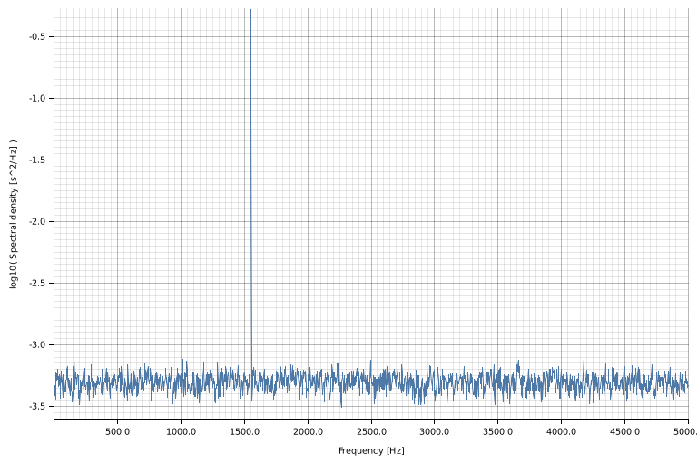

# Spectral density and power spectrum estimation with Welch method

The Welch's method for the estimation of the periodogram of a *stationnary and
zero-mean* signal  involves splitting the signal in overlapping segments, multiplying
each segment with a predeterming window and computing the discrete Fourier transform
of each windowed segment.
The periodogram is then given by the average of the squared magnitude
of each Fourier transform.
Only the halve of the power spectrum that corresponds to positive frequencies is returned,
both halves beeing symmetric with respect to the zero frequency.


From the periodogram, one can derive either the **spectral density** or the **power spectrum**.
Both differs with respect to the scaling of the periodogram.
For the **spectral density**, the periodogram is divided by the product of the sampling frequency with the sum of the squared window samples.
For the **power spectrum**, the periodogram is divided by the square of the sum of the window samples.

## Examples
### Power spectrum
```rust
use rand::prelude::*;
use rand_distr::StandardNormal;
use std::time::Instant;
use welch_sde::{Build, PowerSpectrum};

fn main() {
    let n = 1e6 as usize;
    let signal: Vec<f64> = (0..n)
        .map(|_| 1.234_f64.sqrt() * thread_rng().sample::<f64, StandardNormal>(StandardNormal))
        .collect();
    {
        let mean = signal.iter().cloned().sum::<f64>() / n as f64;
        let variance = signal.iter().map(|s| *s - mean).map(|x| x * x).sum::<f64>() / n as f64;
        println!("Signal variance: {:.3}", variance);
    }

    let welch: PowerSpectrum<f64> = PowerSpectrum::builder(&signal).build();
    println!("{}", welch);

    let now = Instant::now();
    let ps = welch.periodogram();
    println!(
        "Power spectrum estimated in {}ms",
        now.elapsed().as_millis()
    );
    {
        let variance = 2. * ps.iter().sum::<f64>();
        println!("Signal variance from power spectrum: {:.3}", variance);
    }
}
```
### Spectral density
```rust
use rand::prelude::*;
use rand_distr::StandardNormal;
use std::time::Instant;
use welch_sde::{SpectralDensity, Build};

fn main() {
    let n = 1e5 as usize;
    let fs = 10e3_f64;
    let amp = 2. * 2f64.sqrt();
    let freq = 1550f64;
    let noise_power = 0.001 * fs / 2.;
    let sigma = noise_power.sqrt();
    let signal: Vec<f64> = (0..n)
        .map(|i| i as f64 / fs)
        .map(|t| {
            amp * (2. * std::f64::consts::PI * freq * t).sin()
                + thread_rng().sample::<f64, StandardNormal>(StandardNormal) * sigma
        })
        .collect();

    let welch: SpectralDensity<f64> =
        SpectralDensity::<f64>::builder(&signal, fs).build();
    println!("{}", welch);
    let now = Instant::now();
    let sd = welch.periodogram();
    println!(
        "Spectral density estimated in {}ms",
        now.elapsed().as_millis()
    );
    let noise_floor = sd.iter().cloned().sum::<f64>() / sd.len() as f64;
    println!("Noise floor: {:.3}", noise_floor);

    let _: complot::LinLog = (
        sd.frequency()
            .into_iter()
            .zip(&(*sd))
            .map(|(x, &y)| (x, vec![y])),
        complot::complot!(
            "spectral_density.png",
            xlabel = "Frequency [Hz]",
            ylabel = "Spectral density [s^2/Hz]"
        ),
    )
        .into();
}
```

